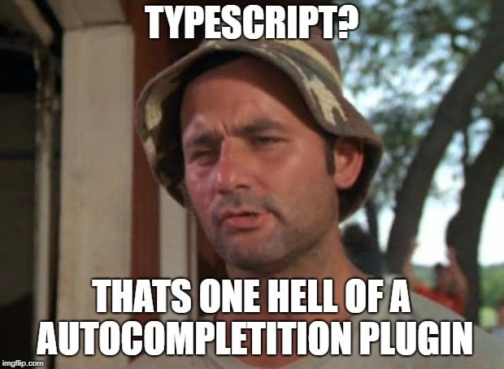

# Atelier Typescript avancé



Bienvenue dans l'atelier Typescript avancé.

Des erreurs se glissent dans le code de cet atelier, c'est normal. Elles sont destinées à êtres corrigées au fur et à mesure.
Le code complété et annoté en fonction des questions se trouvera sur les branches `présentation/<date de la présentation>`.

Ce dépôt peut également évoluer en fonction de vos interrogations ou de l'évolution du langage.

## Sommaire

<ol start="0">
    <li>
        Introduction et notations
        <ol style="list-style-type: lower-alpha">
            <li><code>tsconfig.json</code></li>
            <li>Notation des fonctions</li>
            <li>Interfaces et Types</li>
            <li>Types anonymes</li>
        </ol>
    </li>
    <li>
        <code>any</code> et typage
        <ol style="list-style-type: lower-alpha">
            <li><code>any</code></li>
            <li><code>any</code> implicite</li>
            <li><code>as</code></li>
            <li><code>unknown</code></li>
            <li>Type guards</li>
            <li>Type guards avec "predicate"</li>
        </ol>
    </li>
    <li>
        Generics
        <ol style="list-style-type: lower-alpha">
            <li>Generics</li>
            <li>Retour sur <code>unknown</code></li>
        </ol>
    </li>
    <li>
        <code>let</code>, <code>const</code> ou <code>readonly</code>
        <ol style="list-style-type: lower-alpha">
            <li><code>let</code></li>
            <li><code>const</code></li>
            <li><code>readonly</code></li>
            <li><code>as const</code></li>
        </ol>
    </li>
    <li>
        Tuples
        <ol style="list-style-type: lower-alpha">
            <li>Les tuples</li>
        </ol>
    </li>
    <li>
        Destructuring et spreading
        <ol style="list-style-type: lower-alpha">
            <li>Destructuring</li>
            <li>Spreading</li>
        </ol>
    </li>
    <li>
        Unions
        <ol style="list-style-type: lower-alpha">
            <li>Eviter le type <code>string</code></li>
            <li>Unions VS Enums</li>
            <li>Discriminated unions</li>
            <li>Conversion en union</li>
        </ol>
    </li>
    <li>
        Intersections
        <ol style="list-style-type: lower-alpha">
            <li>Intersections</li>
        </ol>
    </li>
    <li>
        <code>never</code>
        <ol style="list-style-type: lower-alpha">
            <li><code>never</code></li>
        </ol>
    </li>
    <li>
        Utility types
        <ol style="list-style-type: lower-alpha">
            <li><code>Omit</code></li>
            <li><code>Pick</code></li>
            <li><code>Readonly</code></li>
            <li><code>Partial</code></li>
            <li><code>Required</code></li>
            <li><code>Exclude</code></li>
            <li><code>Extract</code></li>
            <li>Autres types et en apprendre plus</li>
        </ol>
    </li>
</ol>

## Exécutez les tests

Je vous suggère d'éxécuter les tests unitaires lors de la progression de cet atelier avec la commande :

```shell
npm run test
```

## Extensions VSCode

Je recommande d'installer l'extension "Twoslash queries" qui permet d'afficher le type d'une variable en utilisant ce commentaire en dessous : `//    ^?`. Par exemple :

```typescript
const duchesse = { nom: 'Duchesse', age: 7 };
//    ^?
```
