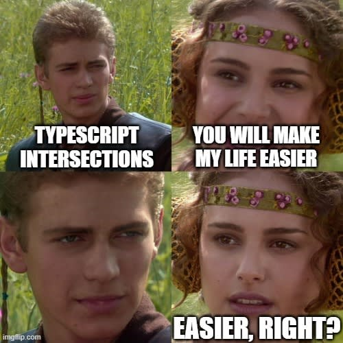

<h1 style="font-size: 11px; margin-bottom: 1rem;">
Intersections
</h1>

```typescript
type Identity = {
  id: number;
  name: string;
};

type Contact = {
  email: string;
  phone: string;
};

type Employee = Identity & Contact;
```

## Introduction



## Sommaire

<ol style="list-style-type: lower-alpha">
    <li>Intersections</li>
</ol>

## Après ce chapitre je saurai

- Combiner plusieurs types en un seul par composition (plutôt que par héritage)
