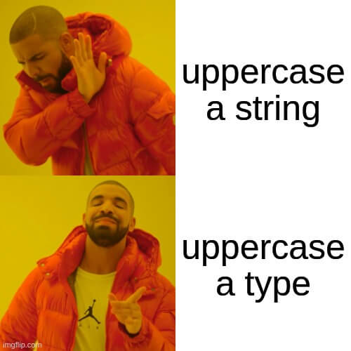

<h1 style="font-size: 11px; margin-bottom: 1rem;">
Utility types
</h1>

```typescript
type Forme =
  | { cotes: 3; name: 'triangle' }
  | { cotes: 4; name: 'carré' }
  | { cotes: 4; name: 'rectangle' }
  | { cotes: 4; name: 'trapèze' }
  | { cotes: 5; name: 'pentagone' }
  | { cotes: 6; name: 'hexagone' };
type ConstQuadrilatère = Exclude<
  Extract<Forme, { cotes: 4 }>,
  { name: 'carré' }
>;
```

## Introduction



Dans **Type**Script il y a **Type** et si vous pensiez qu'il ne s'agissait que de <code>string</code>, <code>number</code>, <code>boolean</code> et quelques classes et interfaces, vous allez tomber de vos chaises.

Avec **Type**Script, on peut créer des types complexes à partir d'autres types complexes, dynamiquement ou non, pour la compilation et le type-checking. C'est extrêmement puissant et toujours incompréhensible !

PS : oui on peut mettre un type en uppercase à l'aide d'un autre type en TypeScript.

## Sommaire

<ol style="list-style-type: lower-alpha">
    <li><code>Omit</code></li>
    <li><code>Pick</code></li>
    <li><code>Readonly</code></li>
    <li><code>Partial</code></li>
    <li><code>Required</code></li>
    <li><code>Exclude</code></li>
    <li><code>Extract</code></li>
    <li>Autres types et en apprendre plus</li>
</ol>

## Après ce chapitre je saurai

- Utiliser les utility types de base fournis par Typescript
- Où chercher si j'ai besoin de types supplémentaires
- Qu'il me reste à découvrir le monde merveilleux de la transformation de type et du "type inference"
